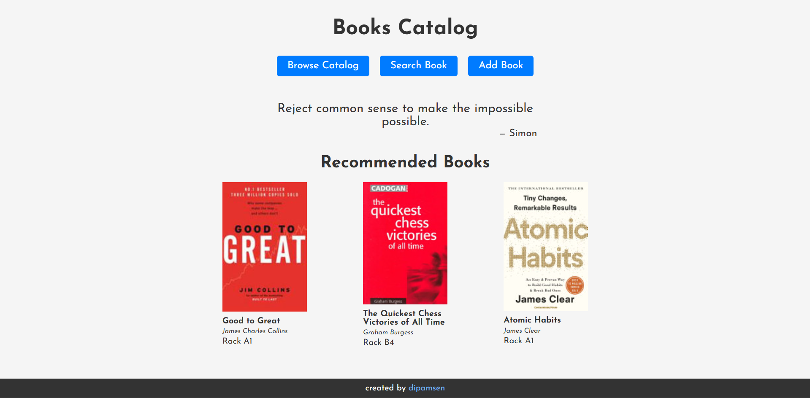

# Book Catalog

An application to keep track of the all books at my home.

## Technologies

React, React Router, Firebase Realtime Database, Google Fonts, Google Books API, [Quotes API](https://github.com/well300/quotes-api)

## Setup

To run this project locally, you need to have Node.js installed on your machine.

1. Clone the repository
2. Run `npm install` to install the dependencies
3. Create a Firebase project and add a Realtime Database
4. Copy `src/config.sample.ts` to `src/config.ts` and add your Firebase configuration
5. Run `npm run dev` to start the development server

## License

[MIT License](./LICENSE)
